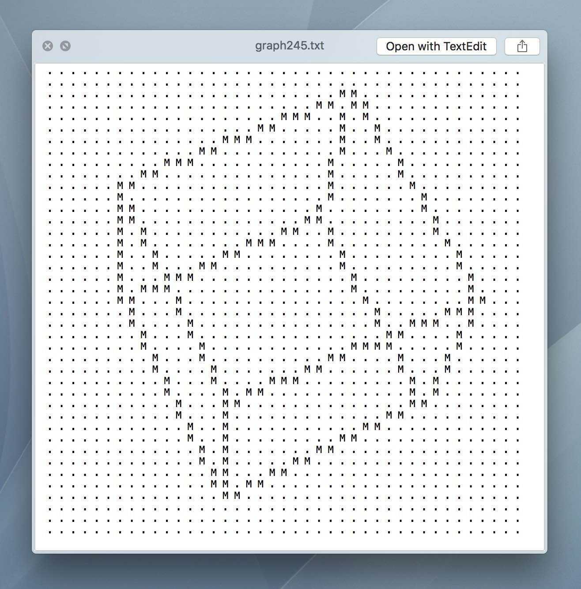

# Text Grapher: 3D Graphics Rendered as Text


## Intro

**What is Text Grapher?** Text Grapher is a python library for rendering graphs and 3D geometries using text. Rather than drawing with pixels in an image, it draws with characters in a string.

**For what purpose?** Text Grapher is mostly an educational novelty. Before this project I had been using 3D software every day without understanding what was happening under the hood. Putting this library together forced me to derive the key concepts that make 3D software tick.

## Super Simple Example

The following code is from the cube example that comes with Text Grapher. 

```python
import text_grapher as tg

scene = tg.Scene()
scene.name = 'cube_example'

scene.graph.center_view()

cube = tg.Cube(size=2)
scene.add(cube)

@scene.animation
def cube_rotation(t):
    cube.rotate(.05, .05, .05)

scene.render(open_player=True)
```

Pretty simple right? We just create a scene, add a cube to it, define an animation and render it out. easy! 

The only lines here that aren't self explanatory are `scene.graph.center_view()` and the animation decorator. The former just centers the origin of the world in the middle of our graph. The latter is how we tell the scene what to animate: any function decorated with `@scene.animation` gets added to a list of functions that run at the begining of each frame. In this example we just rotated the cube a little bit each frame.

There are a couple other examples that come with Text Grapher. Once you install Text Grapher you can run them with `python -m tg_examples.lissajous` or `python -m tg_examples.fireworks`. A window will appear and play the animation.

## Installation

requires Python 3

1. clone this repository.
1. `cd` into it.
1. run `pip3 install .` on mac or `pip install .` on windows
1. PIL is required if you wish to save gifs of your animations: `pip install Pillow`

It's best to take a look at the source code for the examples to get a feel for the usage of this library. 

## Documentation

https://text-grapher.readthedocs.io/en/latest/

## Features

- Render 2D and 3D animations as a series of text files
- Save the animation as a gif (requires PIL)
- Playback Text based animations in a GUI

## Contributing

The best way to contribute at the moment is to write some cool examples! 



**I'm currently working on [this notebook](text_grapher.ipynb), which documents my process of developing Text Grapher.**
