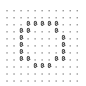

===============
Getting Started
===============

************
Installation
************

TO DO

****************
Printing a Graph
****************

Because this library is all about creating visuals with text, Printing your
first graph is easy to achieve and can be done from the Python REPL.

The graph object is the canvas onto which graphics are drawn.
It exists conceptually as a 2D array, the cells of which can be filled with
characters in order to represent shapes or functions.

The following example shows the three lines necessary to create and show
a blank graph.

>>> import text_grapher as tg
>>> graph = tg.Graph(11, 11)
>>> print(graph)
. . . . . . . . . . .
. . . . . . . . . . .
. . . . . . . . . . .
. . . . . . . . . . .
. . . . . . . . . . .
. . . . . . . . . . .
. . . . . . . . . . .
. . . . . . . . . . .
. . . . . . . . . . .
. . . . . . . . . . .
. . . . . . . . . . .

Let's see where the point (0, 0) is on this graph.

>>> graph.plot(0, 0, '@')
>>> print(graph)
@ . . . . . . . . . .
. . . . . . . . . . .
. . . . . . . . . . .
. . . . . . . . . . .
. . . . . . . . . . .
. . . . . . . . . . .
. . . . . . . . . . .
. . . . . . . . . . .
. . . . . . . . . . .
. . . . . . . . . . .
. . . . . . . . . . .

By default, (0, 0) is in the upper left corner and Y values increase toward the
bottom. Unless you do a lot of GUI programming, you're probably more
comfortable with the origin of the graph at the center with Y values increasing
toward the top. The graph object has a method to accomplish this.

>>> graph.clear()
>>> graph.center_view()
>>> graph.plot(0, 0, '@')
>>> print(graph)
. . . . . . . . . . .
. . . . . . . . . . .
. . . . . . . . . . .
. . . . . . . . . . .
. . . . . . . . . . .
. . . . . @ . . . . .
. . . . . . . . . . .
. . . . . . . . . . .
. . . . . . . . . . .
. . . . . . . . . . .
. . . . . . . . . . .

******************
Graphing Equations
******************

Armed with a Graph object and a method for plotting points,
any math function that can be expressed with python can be
represented on the graph.

Let's create another blank graph to work with.

>>> import text_grapher as tg
>>> graph = tg.Graph(20, 11)
>>> graph.center_view()
>>> print(graph)
. . . . . . . . . . . . . . . . . . . .
. . . . . . . . . . . . . . . . . . . .
. . . . . . . . . . . . . . . . . . . .
. . . . . . . . . . . . . . . . . . . .
. . . . . . . . . . . . . . . . . . . .
. . . . . . . . . . . . . . . . . . . .
. . . . . . . . . . . . . . . . . . . .
. . . . . . . . . . . . . . . . . . . .
. . . . . . . . . . . . . . . . . . . .
. . . . . . . . . . . . . . . . . . . .
. . . . . . . . . . . . . . . . . . . .

Now let's try our hand at graphing a sine wave. We'll grab ``sin``
from the standard library, then iterate through the x-values in the graph
and set y equal to the sine of x. We can plot these (x, y) coordinates with
the graph's plot method.

>>> from math import sin
>>> for x in range(-10, 10):
...     y = sin(x)
...     graph.plot(x, y, '@')
...
>>> print(graph)
. . . . . . . . . . . . . . . . . . . .
. . . . . . . . . . . . . . . . . . . .
. . . . . . . . . . . . . . . . . . . .
. . . . . . . . . . . . . . . . . . . .
@ . . . . @ @ . . . . @ @ . . . . @ @ .
. @ . . @ . . @ . . @ . . @ . . @ . . @
. . @ @ . . . . @ @ . . . . @ @ . . . .
. . . . . . . . . . . . . . . . . . . .
. . . . . . . . . . . . . . . . . . . .
. . . . . . . . . . . . . . . . . . . .
. . . . . . . . . . . . . . . . . . . .

Parametric Equations offer the ability to draw things like circles on the
graph. With these, x and y values are both functions of some other parameter,
often represented as ``t``.

We'll go back to a square graph for this one.

>>> from math import cos
>>> graph = tg.Graph(11, 11)
>>> graph.center_view()
>>> for t in range(100):
...     t *= 0.1
...     y = sin(t) * 4
...     x = cos(t) * 4
...     graph.plot(x, y, '@')
...
>>> print(graph)
. . . . . . . . . . .
. . . @ @ @ @ @ . . .
. . @ @ . . . @ @ . .
. @ @ . . . . . @ @ .
. @ . . . . . . . @ .
. @ . . . . . . . @ .
. @ . . . . . . . @ .
. @ @ . . . . . @ @ .
. . @ @ . . . @ @ . .
. . . @ @ @ @ @ . . .
. . . . . . . . . . .

That's about as close to a circle as we can get at this resolution.

When graphing parametric equations with text_grapher, it's a good idea to
overestimate the range of t values you need, and underestimate the step size.
Over-plotting like that ensures the shape is filled-in on the graph. Too few
t-values and our circle would look a bit sparse.

That sums up the basics of working with the Graph object in text_grapher, in
the next chapter you'll learn how to animate your graphs.

*********
Animation
*********

Animations are, as I'm sure you're aware, a series of still images, which
viewed in rapid succession, create the illusion of movement. With this library,
instead of still images, the frames are text files.

text_grapher has an object called the Scene that simplifies the process of
creating the animation text files. The Scene keeps track of the Graph and any
animations that we define and then uses that information to generate the
frames. It can even open a GUI to play the animation once the frames are ready.

In this section we'll create a simple looping animation of a circle that grows
to fill the width of the graph and then shrinks again.

First we'll set up the Scene.

.. code-block:: python

   from math import sin
   import text_grapher as tg

   # create a scene and name it
   scene = tg.Scene()
   scene.name = 'circle_example'

   # A small graph for this example
   scene.graph.width = 11
   scene.graph.height = 11

   # roughly the period of a sine wave multiplied by ten
   scene.graph.frame_stop = 32

   # put (0, 0) at the center of the graph
   scene.graph.center_view()

The Scene object has a method for adding animations. It can be used to decorate
functions that are meant to be animated. When a function definition is
decorated with ``@scene.animation`` it gets added to a list of functions that
run at the beginning of each frame.

Here we create a function that draws a circle whose radius is based on the
frame number.

.. code-block:: python

   # use the decorator to define our animation
   @scene.animation
   def circle_animation(frame):
       radius = (sin(frame / 10) + 1) * 3 # oscillating radius
       scene.graph.circle(0, 0, radius, '@')

   # render the scene and play it in the GUI
   scene.render(open_player=True)

As an alternative to opening the GUI, if you have PIL installed you can save a
gif of the animation by calling ``scene.render_gif()`` which would be
preferable for sharing your animation.

********
3D Space
********

In addition to keeping track of animations, the Scene object also keeps track
of Entities in 3D space. These include a Camera, and a list of Geometries that
live in the Scene. The API is simple enough that we can create and explore a 3D
scene within the Python REPL.

Lets set up a scene to play with.

>>> import text_grapher as tg
>>> scene = tg.Scene()
>>> scene.graph.width, scene.graph.height = 30, 30
>>> scene.graph.center_view()

Create a cube.

>>> cube = tg.Cube()
>>> scene.add(cube)
>>> scene.frame(1)
>>> print(scene.graph)
. . . . . . . . . . . . . . . . . . . . . . . . . . . . . .
. . . . . . . . . . . . . . . . . . . . . . . . . . . . . .
. . . . . . . . . . . . . . . . . . . . . . . . . . . . . .
. . . . . . . . . . . . . . . . . . . . . . . . . . . . . .
. . . . . . . . . . . . . . . . . . . . . . . . . . . . . .
. . . . . . . . . . . . . . . . . . . . . . . . . . . . . .
. . . . . . . . . . . . . . . . . . . . . . . . . . . . . .
. . . . . . . . . . . . . . . . . . . . . . . . . . . . . .
. . . . . . . . . . . . . . . . . . . . . . . . . . . . . .
. . . . . . . . . . . . . . . . . . . . . . . . . . . . . .
. . . . . . . . . . @ @ @ @ @ @ @ @ @ @ . . . . . . . . . .
. . . . . . . . . . @ @ @ @ @ @ @ @ @ @ @ . . . . . . . . .
. . . . . . . . . . @ @ . . . . . . . @ @ . . . . . . . . .
. . . . . . . . . . @ @ . . . . . . . @ @ . . . . . . . . .
. . . . . . . . . . @ @ . . . . . . . @ @ . . . . . . . . .
. . . . . . . . . . @ @ . . . . . . . @ @ . . . . . . . . .
. . . . . . . . . . @ @ . . . . . . . @ @ . . . . . . . . .
. . . . . . . . . . @ @ . . . . . . . @ @ . . . . . . . . .
. . . . . . . . . . @ @ . . . . . . . @ @ . . . . . . . . .
. . . . . . . . . . @ @ @ @ @ @ @ @ @ @ @ . . . . . . . . .
. . . . . . . . . . @ @ @ @ @ @ @ @ @ @ @ . . . . . . . . .
. . . . . . . . . . . . . . . . . . . . . . . . . . . . . .
. . . . . . . . . . . . . . . . . . . . . . . . . . . . . .
. . . . . . . . . . . . . . . . . . . . . . . . . . . . . .
. . . . . . . . . . . . . . . . . . . . . . . . . . . . . .
. . . . . . . . . . . . . . . . . . . . . . . . . . . . . .
. . . . . . . . . . . . . . . . . . . . . . . . . . . . . .
. . . . . . . . . . . . . . . . . . . . . . . . . . . . . .
. . . . . . . . . . . . . . . . . . . . . . . . . . . . . .
. . . . . . . . . . . . . . . . . . . . . . . . . . . . . .

Scale up the cube.

>>> cube.resize(1.6, 1.6, 1.6)
>>> scene.frame(1)
>>> print(scene.graph)
. . . . . . . . . . . . . . . . . . . . . . . . . . . . . .
. . . . . . . . . . . . . . . . . . . . . . . . . . . . . .
. . . . . . . . . . . . . . . . . . . . . . . . . . . . . .
. . . . . . . . . . . . . . . . . . . . . . . . . . . . . .
. . . . . . . . . . . . . . . . . . . . . . . . . . . . . .
. . . . . . . . . . . . . . . . . . . . . . . . . . . . . .
. . . . . . . . . . . . . . . . . . . . . . . . . . . . . .
. . . . . . . @ @ @ @ @ @ @ @ @ @ @ @ @ @ @ @ . . . . . . .
. . . . . . . @ @ . . . . . . . . . . . . . @ @ . . . . . .
. . . . . . . @ . @ @ @ @ @ @ @ @ @ @ @ @ @ . @ . . . . . .
. . . . . . . @ . @ . . . . . . . . . . . @ . @ . . . . . .
. . . . . . . @ . @ . . . . . . . . . . . @ . @ . . . . . .
. . . . . . . @ . @ . . . . . . . . . . . @ . @ . . . . . .
. . . . . . . @ . @ . . . . . . . . . . . @ . @ . . . . . .
. . . . . . . @ . @ . . . . . . . . . . . @ . @ . . . . . .
. . . . . . . @ . @ . . . . . . . . . . . @ . @ . . . . . .
. . . . . . . @ . @ . . . . . . . . . . . @ . @ . . . . . .
. . . . . . . @ . @ . . . . . . . . . . . @ . @ . . . . . .
. . . . . . . @ . @ . . . . . . . . . . . @ . @ . . . . . .
. . . . . . . @ . @ . . . . . . . . . . . @ . @ . . . . . .
. . . . . . . @ . @ . . . . . . . . . . . @ . @ . . . . . .
. . . . . . . @ . @ @ @ @ @ @ @ @ @ @ @ @ @ . @ . . . . . .
. . . . . . . @ @ . . . . . . . . . . . . . @ @ . . . . . .
. . . . . . . @ @ @ @ @ @ @ @ @ @ @ @ @ @ @ @ @ . . . . . .
. . . . . . . . . . . . . . . . . . . . . . . . . . . . . .
. . . . . . . . . . . . . . . . . . . . . . . . . . . . . .
. . . . . . . . . . . . . . . . . . . . . . . . . . . . . .
. . . . . . . . . . . . . . . . . . . . . . . . . . . . . .
. . . . . . . . . . . . . . . . . . . . . . . . . . . . . .
. . . . . . . . . . . . . . . . . . . . . . . . . . . . . .

Rotate the cube.

>>> cube.rotate(y=0.6)
>>> scene.frame(1)
>>> print(scene.graph)
. . . . . . . . . . . . . . . . . . . . . . . . . . . . . .
. . . . . . . . . . . . . . . . . . . . . . . . . . . . . .
. . . . . . . . . . . . . . . . . . . . . . . . . . . . . .
. . . . . . . . . . . . . . . . . . . . . . . . . . . . . .
. . . . . . . . . . . . . . . . . . . . . . . . . . . . . .
. . . . . . . . . . . . . . . . . . . . . . . . . . . . . .
. . . . . . . . . . . . . . . . . . . . . . . . . . . . . .
. . . . . . @ @ @ @ @ @ @ @ @ @ @ @ @ @ @ @ @ @ @ . . . . .
. . . . . @ @ @ @ @ @ @ @ @ @ @ . @ @ @ @ @ @ @ @ @ . . . .
. . . . . @ . . . . . . . @ . . @ . . . . . . . . @ . . . .
. . . . . @ . . . . . . . @ . . @ . . . . . . . . @ . . . .
. . . . . @ . . . . . . . @ . . @ . . . . . . . . @ . . . .
. . . . . @ . . . . . . . @ . . @ . . . . . . . . @ . . . .
. . . . . @ . . . . . . . @ . . @ . . . . . . . . @ . . . .
. . . . . @ . . . . . . . @ . . @ . . . . . . . . @ . . . .
. . . . . @ . . . . . . . @ . . @ . . . . . . . . @ . . . .
. . . . . @ . . . . . . . @ . . @ . . . . . . . . @ . . . .
. . . . . @ . . . . . . . @ . . @ . . . . . . . . @ . . . .
. . . . . @ . . . . . . . @ . . @ . . . . . . . . @ . . . .
. . . . . @ . . . . . . . @ . . @ . . . . . . . . @ . . . .
. . . . . @ . . . . . . . @ . . @ . . . . . . . . @ . . . .
. . . . . @ @ @ @ @ @ @ @ @ @ @ @ @ @ @ @ @ @ @ @ @ . . . .
. . . . . @ @ @ @ @ @ @ @ @ @ @ @ @ @ @ @ @ @ @ @ @ . . . .
. . . . . . . . . . . . . @ . . . . . . . . . . . . . . . .
. . . . . . . . . . . . . . . . . . . . . . . . . . . . . .
. . . . . . . . . . . . . . . . . . . . . . . . . . . . . .
. . . . . . . . . . . . . . . . . . . . . . . . . . . . . .
. . . . . . . . . . . . . . . . . . . . . . . . . . . . . .
. . . . . . . . . . . . . . . . . . . . . . . . . . . . . .
. . . . . . . . . . . . . . . . . . . . . . . . . . . . . .

Still not super cube-ish-looking. lets try rotating on another axis.

>>> cube.rotate(x=0.6)
>>> scene.frame(1)
>>> print(scene.graph)
. . . . . . . . . . . . . . . . . . . . . . . . . . . . . .
. . . . . . . . . . . . . . . . . . . . . . . . . . . . . .
. . . . . . . . . . . . . . . . . . . . . . . . . . . . . .
. . . . . . . . . . . . . . . . . . . . . . . . . . . . . .
. . . . . . . . . . . . . . . . . . . . . . . . . . . . . .
. . . . . . . . @ @ @ @ @ @ @ @ @ @ @ . . . . . . . . . . .
. . . . . . . @ @ @ . . . . . . . . . @ @ . . . . . . . . .
. . . . . . . @ . @ @ . . . . . . . @ . @ @ . . . . . . . .
. . . . . . @ . . . @ @ . . . . . . @ . . @ @ . . . . . . .
. . . . . . @ . . . . @ @ . . . . @ . . . . @ @ . . . . . .
. . . . . . @ . . . . . @ @ . . . @ . . . . . @ @ . . . . .
. . . . . @ . . . . . . . @ @ . . @ . . . . . . @ @ . . . .
. . . . . @ . . . . . . . . @ . @ . . . . . . . . @ @ . . .
. . . . . @ . . . . . . . . . @ @ @ @ @ @ @ @ @ @ @ @ @ . .
. . . . @ . . . . . . . . . @ @ . . . . . . . . . . @ . . .
. . . . @ . . . . . . . . . @ @ . . . . . . . . . . @ . . .
. . . . @ @ @ @ @ @ @ @ @ @ @ @ . . . . . . . . . @ . . . .
. . . . @ @ . . . . . . . @ . @ @ . . . . . . . . @ . . . .
. . . . . @ . . . . . . . @ . . @ @ . . . . . . @ . . . . .
. . . . . @ @ . . . . . @ . . . . @ @ . . . . . @ . . . . .
. . . . . . @ . . . . . @ . . . . . @ . . . . . @ . . . . .
. . . . . . . @ . . . @ . . . . . . @ @ . . . @ . . . . . .
. . . . . . . @ @ . . @ . . . . . . . @ @ . . @ . . . . . .
. . . . . . . . @ . . @ . . . . . . . . @ @ @ . . . . . . .
. . . . . . . . @ @ @ . . . . . . . . . . @ @ . . . . . . .
. . . . . . . . . @ @ @ @ @ @ @ @ @ @ @ @ @ @ . . . . . . .
. . . . . . . . . . @ . . . . . . . . . . . . . . . . . . .
. . . . . . . . . . . . . . . . . . . . . . . . . . . . . .
. . . . . . . . . . . . . . . . . . . . . . . . . . . . . .
. . . . . . . . . . . . . . . . . . . . . . . . . . . . . .

We can also transform the Scene's camera.

>>> scene.camera.translate(z=-6)
>>> scene.frame(1)
>>> print(scene.graph)
. . . . . . . . . . . . . . . . . . . . . . . . . . . . . .
. . . . . . . . . . . . . . . . . . . . . . . . . . . . . .
. . . . . . . . . . . . . . . . . . . . . . . . . . . . . .
. . . . . . . . . . . . . . . . . . . . . . . . . . . . . .
. . . . . . . . . . . . . . . . . . . . . . . . . . . . . .
. . . . . . . . . . . . . . . . . . . . . . . . . . . . . .
. . . . . . . . . . . . . . . . . . . . . . . . . . . . . .
. . . . . . . . . . . . . . . . . . . . . . . . . . . . . .
. . . . . . . . . . @ @ @ @ @ @ @ @ @ . . . . . . . . . . .
. . . . . . . . . @ @ @ . . . . . @ . @ . . . . . . . . . .
. . . . . . . . . @ . @ @ . . . . @ . . @ . . . . . . . . .
. . . . . . . . @ . . . @ @ . . @ . . . . @ . . . . . . . .
. . . . . . . . @ . . . . @ @ . @ . . . . . @ . . . . . . .
. . . . . . . . @ . . . . . @ . @ . . . . . . @ . . . . . .
. . . . . . . @ . . . . . . . @ @ @ @ @ @ @ @ @ @ . . . . .
. . . . . . . @ . . . . . . @ @ . . . . . . . @ . . . . . .
. . . . . . . @ @ @ @ @ @ @ @ @ . . . . . . . @ . . . . . .
. . . . . . . @ @ . . . . . @ @ @ . . . . . @ . . . . . . .
. . . . . . . . @ @ . . . @ . . @ @ . . . . @ . . . . . . .
. . . . . . . . . @ . . . @ . . . @ @ . . @ . . . . . . . .
. . . . . . . . . @ @ . . @ . . . . @ @ . @ . . . . . . . .
. . . . . . . . . . @ @ @ . . . . . . @ @ . . . . . . . . .
. . . . . . . . . . . @ @ @ @ @ @ @ @ @ @ . . . . . . . . .
. . . . . . . . . . . . @ . . . . . . . . . . . . . . . . .
. . . . . . . . . . . . . . . . . . . . . . . . . . . . . .
. . . . . . . . . . . . . . . . . . . . . . . . . . . . . .
. . . . . . . . . . . . . . . . . . . . . . . . . . . . . .
. . . . . . . . . . . . . . . . . . . . . . . . . . . . . .
. . . . . . . . . . . . . . . . . . . . . . . . . . . . . .
. . . . . . . . . . . . . . . . . . . . . . . . . . . . . .
